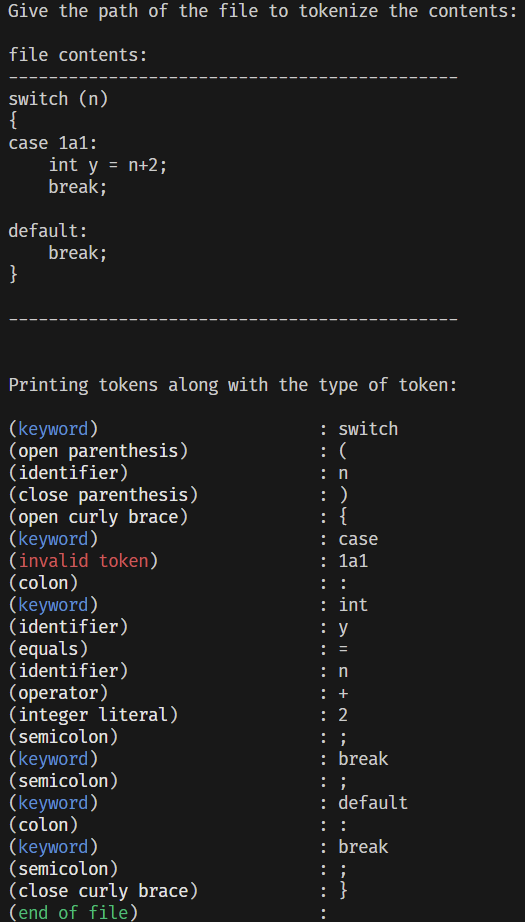

|What is left | Explanation |
|-|-|
|Statements | Parser cannot parse `statement` production properly |
|Parse Tree | - |

The tokenize function can read through some things and this is the output it shows.
 
 
</img>